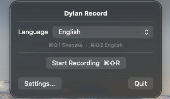

# Dylan Record

A dead-simple macOS meeting recorder for a single user — built so your AI can sit in the meeting with you.

It records your meeting (your mic **and** the other side's computer audio), transcribes it live with Deepgram, and **streams the transcript into your Obsidian vault in real time**. Because the note is written to disk line-by-line as people talk, your harness — Claude Code, Codex, a "brain" agent, whatever you run — can tail the conversation and help you *during* the meeting: surface answers, catch action items, look things up, draft replies.

When you stop, it finalizes the note in place (and can add an AI summary). Nothing depends on a clean save at the end — the transcript is already in your vault.



## How it works

- While recording, the note is written to `<your-vault>/Meetings/<date> <name>.md` and rewritten on every finalized line.
- While live, its frontmatter contains `status: recording` — that's how an agent finds the active meeting.
- Point your agent at the Meetings folder and say "follow my current meeting"; it reads the file with `status: recording` and re-reads as it grows.

## Requirements

- macOS 14.4 or later (system-audio capture uses Core Audio process taps)
- A [Deepgram](https://deepgram.com) API key (transcription) — required
- An [Anthropic](https://www.anthropic.com) API key (AI meeting summaries) — optional
- An Obsidian vault (any folder containing a `.obsidian` directory)
- Xcode (to build; the `.xcodeproj` is committed, so [XcodeGen](https://github.com/yonaskolb/XcodeGen) is only needed if you regenerate it from `project.yml`)

## Setup

```bash
git clone git@github.com:Wirasm/dylan-record.git
cd dylan-record

# One time: create a stable self-signed signing identity in your keychain.
# This keeps macOS permissions from resetting on every rebuild.
scripts/create-signing-cert.sh

# Build, sign, and install to /Applications
scripts/install.sh
```

Then launch **Dylan Record** (it lives in the menu bar — no Dock icon) and open **Settings**:

1. Paste your **Deepgram API key** (and optionally an **Anthropic API key** for summaries).
2. Set your **Obsidian vault path** (the vault root, or any subfolder inside it).
3. Optionally edit **Keywords** (one per line) to boost recognition of names and jargon, and pick a **Language**.

### Grant permissions on first record

Start a recording once and approve the macOS prompts:

- **Microphone** — your voice
- **Screen & System Audio Recording** — the other side's audio (you may need to quit and reopen the app after granting)
- **Accessibility** — the global ⌘⇧R hotkey

These stick across rebuilds thanks to the stable signing identity.

## Using it

- **⌘⇧R** — start / stop recording (or use the menu bar)
- **⌘⇧1 / ⌘⇧2** — switch language to Svenska / English
- Languages: Auto-detect, Svenska, English, Dansk, Norsk, Deutsch, Français, Español, Nederlands, 日本語
- On stop, name the meeting and save — the note is finalized in place and opened in Obsidian.

## License

MIT — see [LICENSE](LICENSE).
